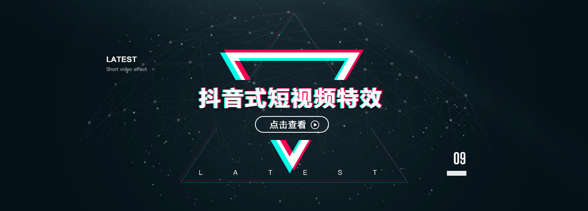

# AiyaEffectsSDK iOS Guide

## 1. Summary
AiyaEffectsSDK is a high-performance rendering solution about dynamic stickers and animation effects which based on the independent research and development of face recognition module and it can be used to Android/iOS , two platforms.

### 1.1 Version Info
Current Version : v4.0.4 [More](doc/versionHistory.md)

### 1.2 Integration Examples
* [AiyaEffectsSDK with KSVC Demo](https://github.com/aiyaapp/AiyaEffectsWithKSVCIOS)
* [AiyaEffectsSDK with ZEGOLive Demo](https://github.com/aiyaapp/AiyaEffectsWithZegoIOS)
* [AiyaEffectsSDK with Tencent Demo](https://github.com/aiyaapp/AiyaEffectsWithTXIOS)
* [AiyaEffectsSDK with Agora Demo](https://github.com/aiyaapp/AiyaEffectsWithAgoraIOS)

### 1.3 About Hotfix
AiyaEffectsSDK pledge [AiyaEffectsSDK iOS](https://github.com/aiyaapp/AiyaEffectsIOS) don't use hotfix。

## 2. Features

### Features List
- [x] support dynamic stickers
- [x] support 10 seconds long frame animation
- [x] support DIY dynamic stickers
- [x] support DIY frame animation
- [x] support smooth face
- [x] support big eyes, slim face
- [x] support short video effects, just like 'musically'

## 3. Runtime Environment
AiyaEffectsSDK runs on the armv7/armv7s/arm64, not runs on the the simulator.

## 4. Get SDK
There are two ways to get our sdk:

* [github](https://github.com/aiyaapp/AiyaEffectsIOS)
* [oschina](http://git.oschina.net/wangyng/AiyaEffectsIOS), Access to faster in China.

## 5. Quick Start
[Quick Start](doc/howToUse.md)

## 6. Custom Dynamic Sticker And Frame Animation
The document of custom dynamic sticker is not officially opened, please [constact us](http://www.lansear.cn/product/bbtx) to get.

## 7. License
* Get a AiyaEffectsSDK license, please open the [AiyaEffectsSDK](http://www.lansear.cn/product/bbtx) website

## 8. Feedback
- Homepage: [AiyaEffectsSDK](http://www.lansear.cn/product/bbtx)
- Phone: +86 18676907096
- Email: <liudawei@aiyaapp.com> 
- Tencent QQ Group: 650242833

