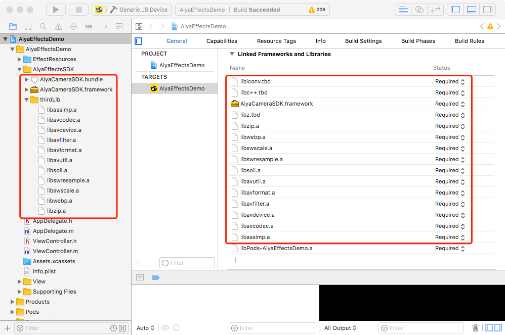
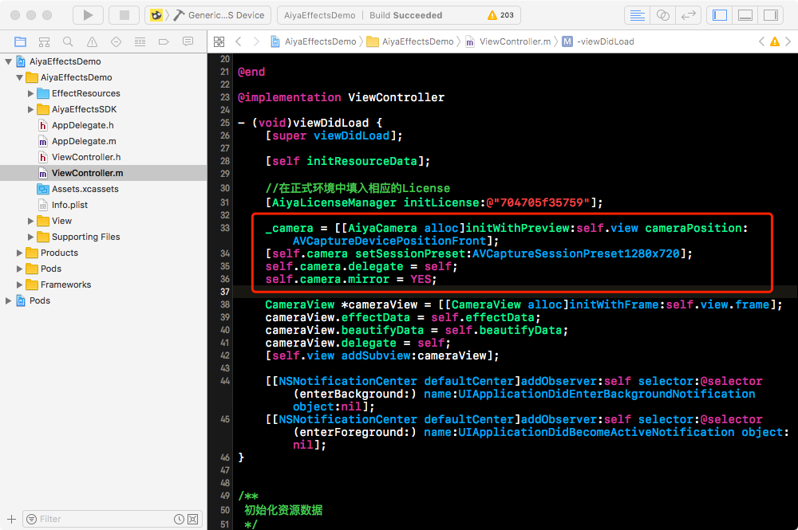
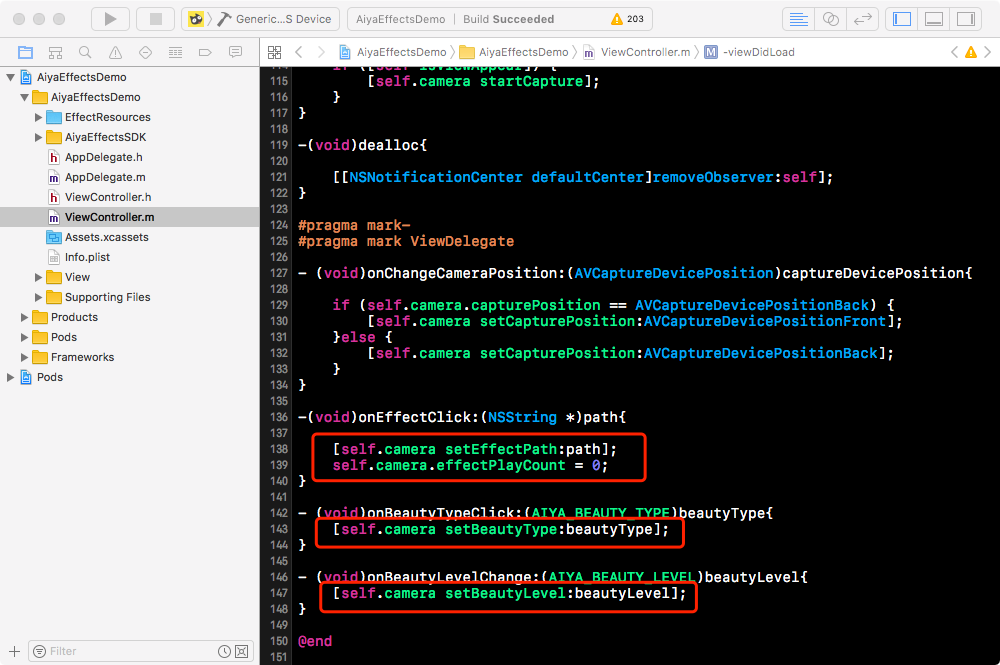
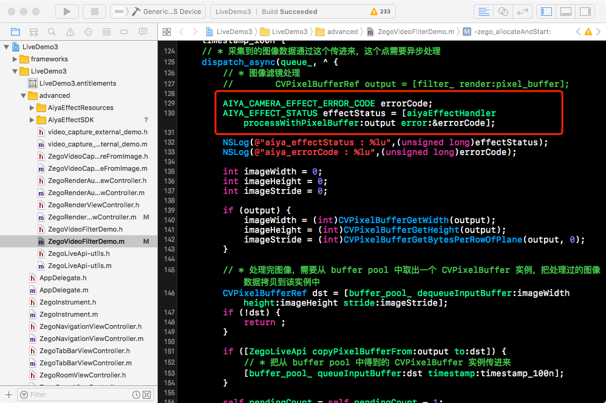

# 宝宝特效 AiyaEffecSDK iOS 快速集成

## Step1 集成framework
将 宝宝特效 AiyaEffectSDK iOS 解压后， 将 AiyaEfffectsDemo/AiyaEffectSDK 目录拖到项目中.然后添加另外三个系统库:
* libiconv.tdb
* libc++.tdb
* libz.tdb

## Step2 初始化License
在使用AiyaCameraSDK之前，必须先初始化license，否则会出现无法使用的情况，申请appKey请访问[宝宝特效 免费使用](http://bbtexiao.aiyaapp.com/site/free)

## Step3 调用

### 调用方式一:
使用AiyaCamera预览和处理数据， 这种方式可直接参考[AiyaEffectsDemo](https://github.com/aiyaapp/AiyaEffectsIOS)

### 调用方式二:
把AiyaEffectSDK 封装成GPUImageFilter使用， 这种方式可参考[KSYAiyaDemo](https://github.com/aiyaapp/AiyaEffectsWithKSVCIOS)

### 调用方式三:
使用AiyaEffectHandler 处理 CVPixelBufferRef， 这种方式可参考[zegoAiyaDemo](https://github.com/aiyaapp/AiyaEffectsWithZegoIOS)

  

### 调用方式四:
只绘制帧画面不绘制人脸特效，可以使用AiyaAnimHandler 进行帧动画的绘制，这种方式可参考[AiyaEffectsLite](https://github.com/aiyaapp/AiyaEffectsLiteIOS)

  
