# 宝宝特效 AiyaEffecSDK iOS 快速集成

## Step1 集成framework
 1. 下载 AiyaEffectsIOS 项目， 解压后将 AiyaEffectsIOS/AiyaEffectSDK 复制到目标工程文件夹中以便于管理， 如果不想复制也行

 2. 拖动 AiyaEffectsIOS/AiyaEffectSDK/AiyaEffectSDK.xcodeproj 到xcode工程中

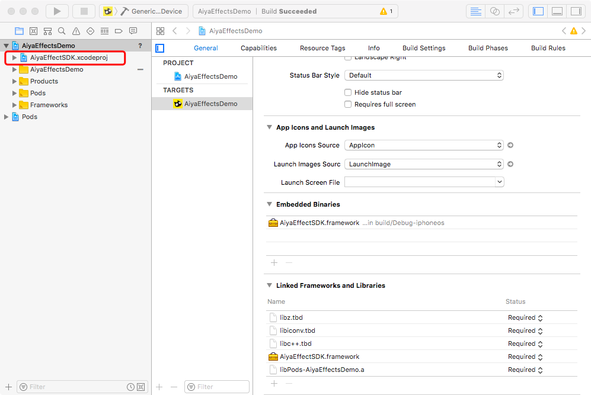

 3. 添加外部工程依赖

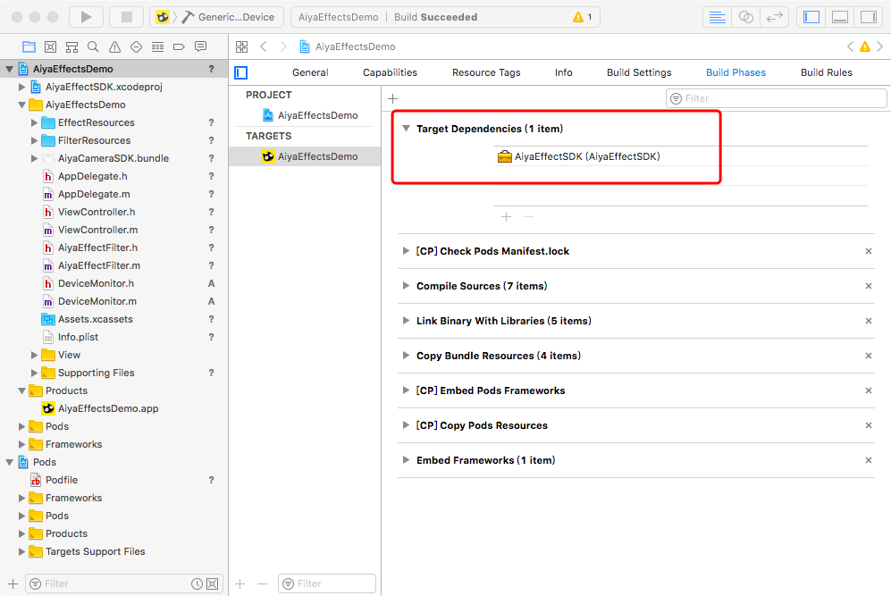

 4. 链接SDK

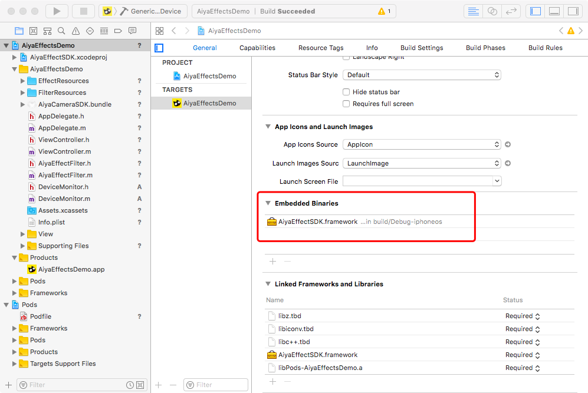

 5. 链接系统库

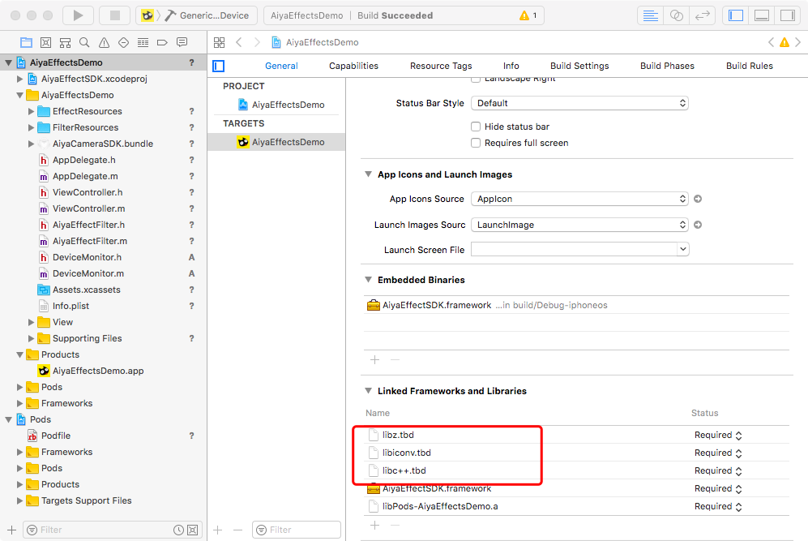

 6. 根据需求选择相应的模块， 模块越少， 对App大小的增量就越小

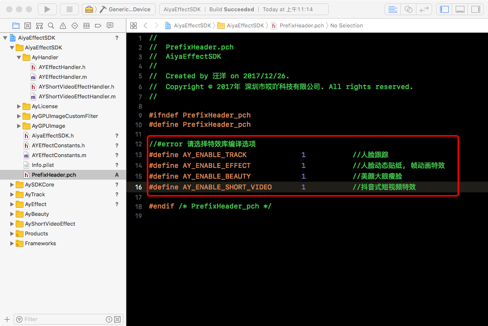

 7. 导入bundle资源， 拖动AiyaEffectsIOS/AiyaEffectSDK/AiyaEffectSDK.bundle到xcode工程中

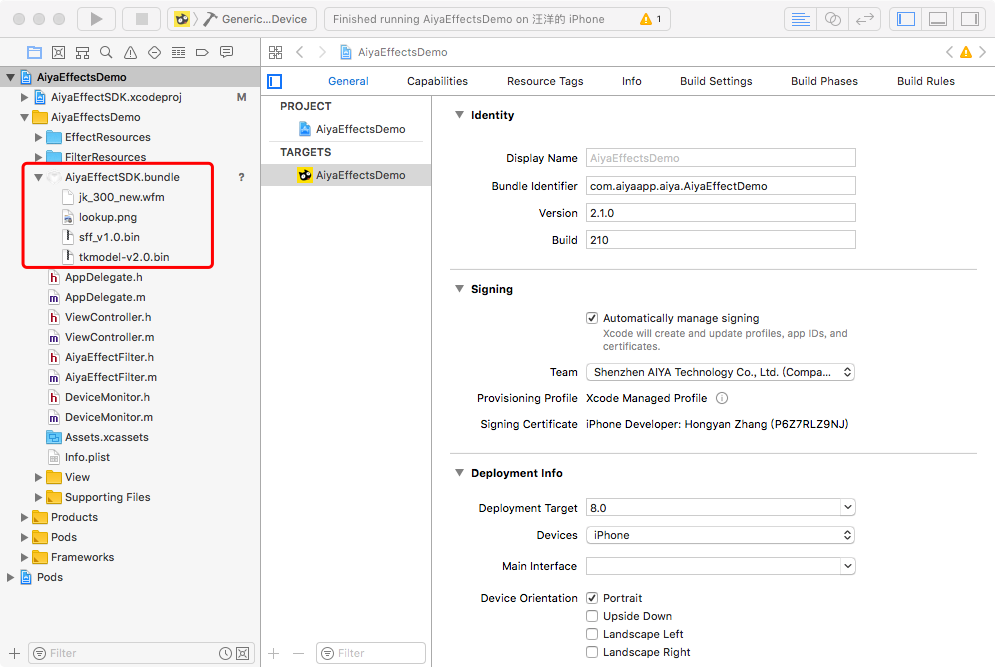

注意: 如果不使用人脸识别模块可以移除 AiyaEffectSDK.bundle中的 jk_300.new.wfm， sff_v1.0.bin， tkmodel_v2.0.bin

注意: 如果不使用滤镜可以移除 AiyaEffectSDK.bundle中的 lookup.png

## Step2 初始化License
在使用 AiyaEffecSDK 之前，必须先初始化 license，否则会出现无法使用的情况，申请 appKey 请访问[宝宝特效](http://www.lansear.cn/product/bbtx)

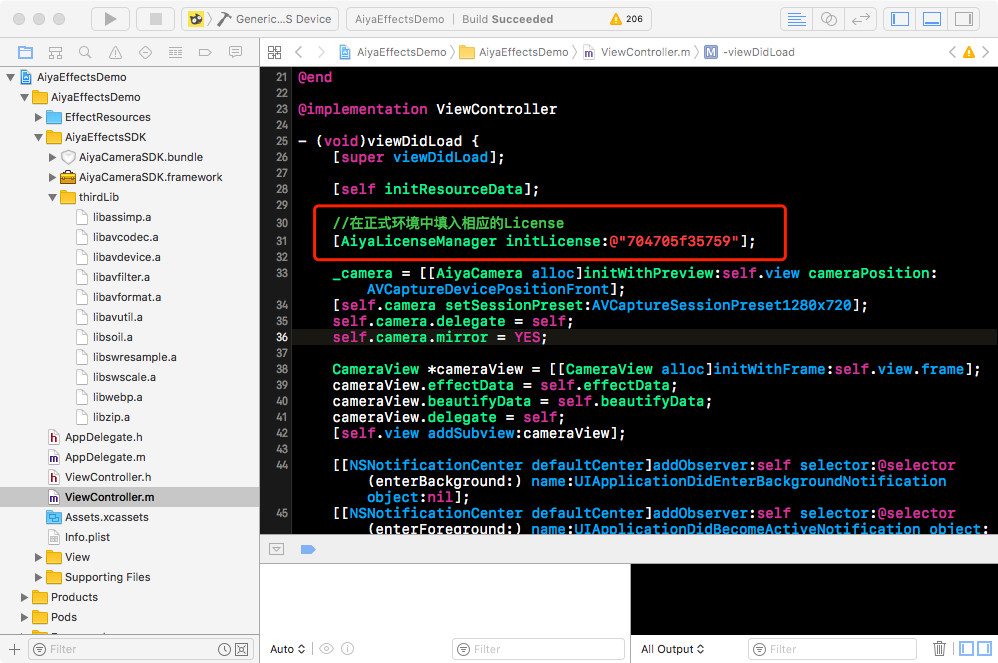

## Step3 使用动态贴纸

### 调用方式一:
创建自定义相机， 实现拍照和录制加贴纸功能，这种方式可参考 AiyaEffectsIOS/demo/AiyaVideoRecord

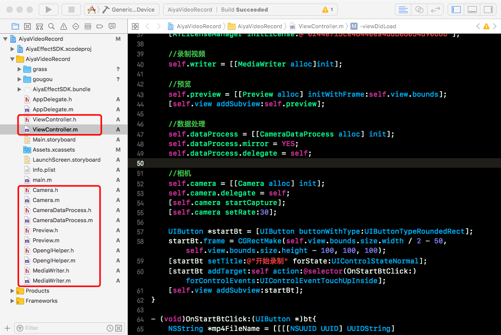

### 调用方式二:
把 AYEffectHandler 封装成 GPUImageFilter 使用， 这种方式可参考 AiyaEffectsIOS/demo/AiyaEffectSDKDemo

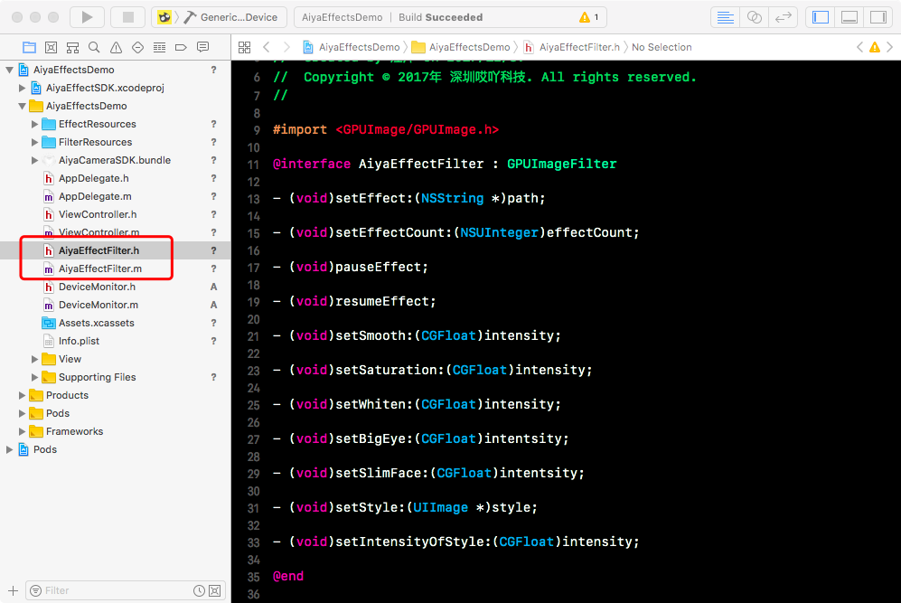

### 调用方式三:
使用 AYEffectHandler 处理 CVPixelBufferRef (BGRA格式)， 这种方式可参考[集成到Zego示例](https://github.com/aiyaapp/AiyaEffectsWithZegoIOS)

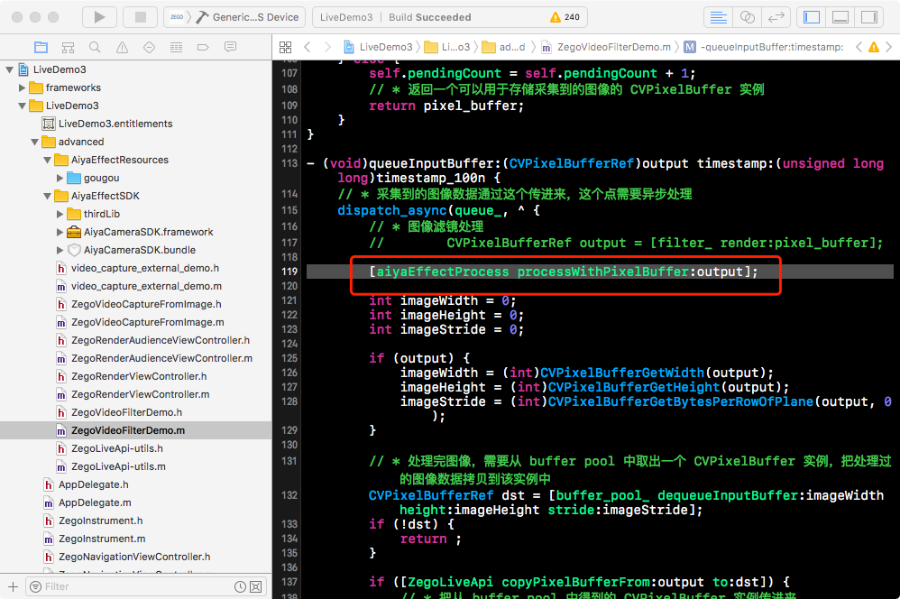

### 调用方式四:
使用 AYEffectHandler 处理 Texture (BGRA格式)， 这种方式可参考[集成到腾讯云示例](https://github.com/aiyaapp/AiyaEffectsWithTXIOS)

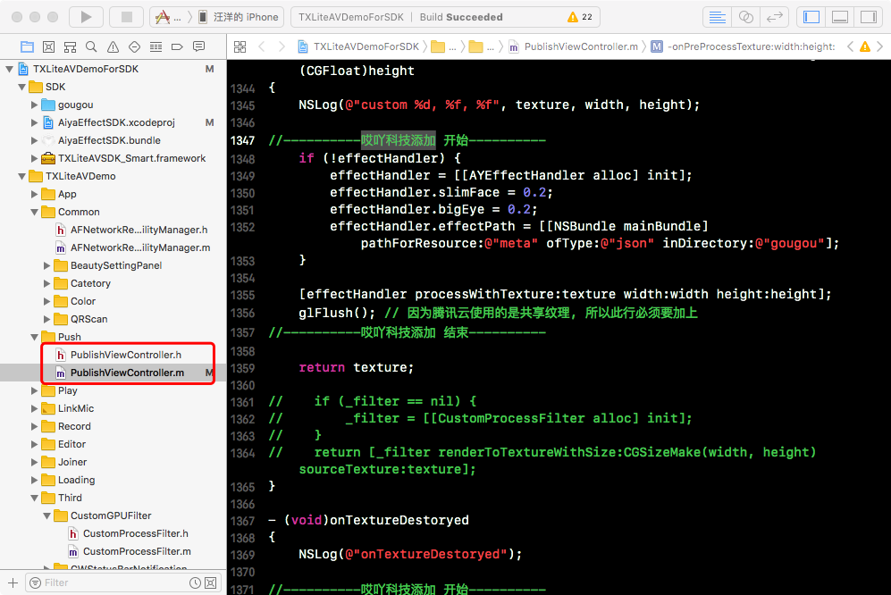

## Step4 使用帧动画特效

### 调用方式:
使用 AYAnimHandler 进行帧动画绘制，这种方式可参考 AiyaEffectsIOS/demo/AiyaAnimEffectDemo

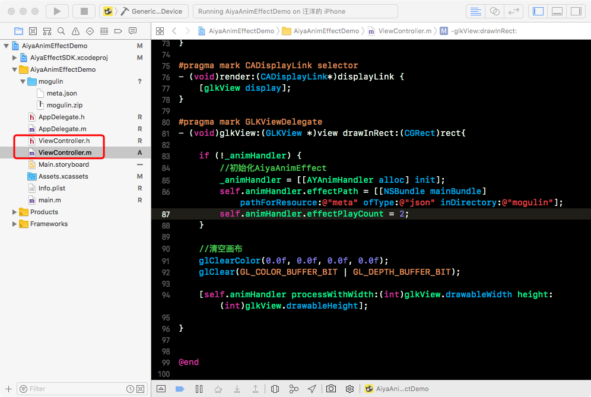

## Step5 使用短视频特效

### 调用方式:
使用 AYShortVideoEffectHandler 处理 Texture (BGRA格式)， 这种方式可参考 AiyaEffectsIOS/demo/AiyaShortVideoEffectDemo

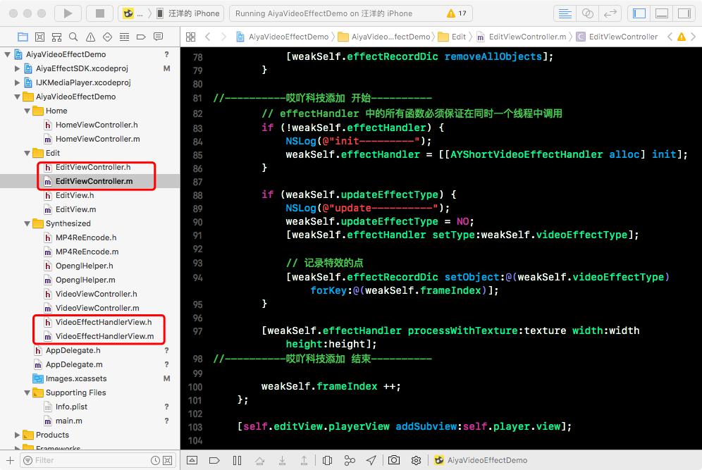
